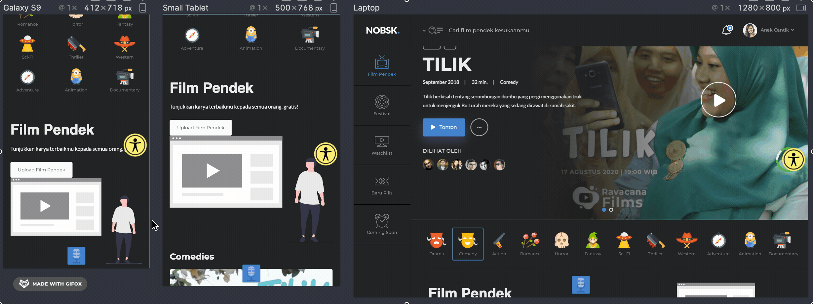
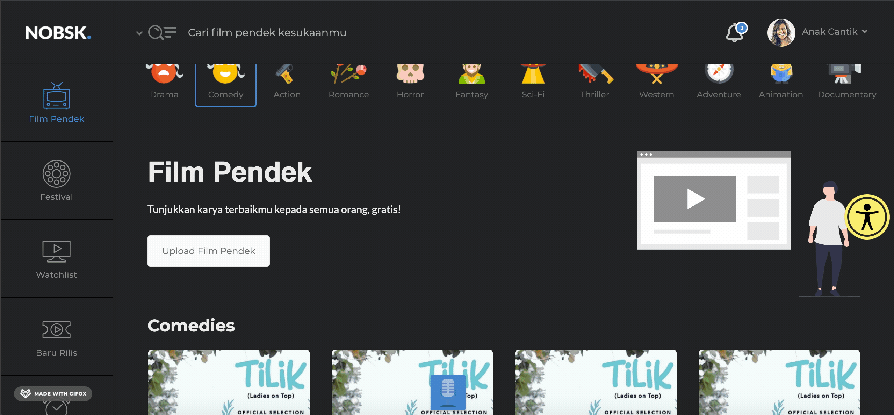

# NOBSK

[](https://hackmd.io/g57oFvBCQJ2kNNN1_pBp3g)


NOBSK is a minimal, attractive, milenial short film screening for Indonesian Film Festival. NOBSK adalah web-aplikasi yang untuk festival film pendek di Indonesia. Term ‘NOBSK.’ merupakan singkatan dari kata “NOnton-film-pendek Bareng SKuy”, di mana tujuan dari web-aplikasi ini selain untuk menyediakan screening karya film pendek oleh para pegiat film pendek di Indonesia yang bisa ditonton oleh siapa saja tanpa harus keluar rumah alias “short-film screening from home”, NOBSK juga memiliki fungsi sebagai “call for entries and festivals” yaitu manajemen film pendek untuk para Organizer. Ada beberapa role pada web-aplikasi ini: Short-film Organizer, Filmmaker/Participant, Reviewer dan Guest. NOBSK didesain dengan model interaksi yang minimalis, millennial-friendly, responsive, dan easy to navigate, sehingga harapan pengamalan berselancar di web-aplikasi ini tak kalah dengan berada di short-film screening fisikal. NOBSK memiliki inovasi dalam hal interaksinya, yaitu "Amy" sebagai tiny-based AI yang kami buat sebagai "penunggu" dari NOBSK yang dapat membantu user melakukan navigasi dan berselancar di NOBSK (Apa itu Amy? Akan dijelaskan pada poin selanjutnya).

Dekade ini, kreativitas anak bangsa di dunia perfilman tidak bisa dianggap remeh, terutama di kancah film pendek. Sudah banyak penghargaan Internasional yang didapatkan atas karya orisinil film pendek karya anak bangsa. Festival Film Pendek adalah suatu event di mana para filmmaker bisa berpartisipasi dan berkarya, meningkatkan kemampuan dengan bantuan para reviewer yang tergabung dalam festival, serta bisa terhubung dengan filmmaker lainnya. Namun tidak ada sistem terpadu yang mewadahi hal-hal yang telah disebutkan. Untuk itulah NOBSK hadir sebagai solusi yang menyediakan wadah untuk berkumpulnya para filmmaker, organizer, reviewer, dan penggemar film pendek untuk menciptakan karya film pendek orisinil dan meningkatkan kualitas perfilman Indonesia.

*Kelompok:*
- **Alfian Firmansyah | 1706985874**
- Kristian Girsang | 1706986012
- Samuel Natanael | 1706986076

---
FIGMA DESIGN: https://www.figma.com/file/RX4urxUzEEv3wyo4SLzM4d/Film-Detail?node-id=0%3A1
---

 ==>> 


---

---


## Demo

Tidak perlu menginstall pada mesin, maka bisa mengunjungi url environment nobsk pada link berikut: [di sini](https://nobsk.herokuapp.com)

## Installation

Catatan: Tidak direkomendasikan untuk membuka `index.html` secara langsung, karena ada beberapa dependensi yang dijalankan melalui webserver. Maka dari itu, berikut langkah yang dapat diikuti.

1. Download .zip / Clone repository nobsk. Atau rekomendasi download release versi stable kami: https://github.com/nobsk/nobsk.github.io/releases/tag/v1.0.0
2. Extract .zip yang sudah didownload, letakkan pada folder webroot/htdocs pada web server yang ada pada mesin (xampp, mamp, lamp)
3. Akses dengan url: http://localhost/<nama_folder>


## Amy: Adorable Machine Yawner - The First Website Assistant by nobsk

Mengapa kami membuat Amy? jawabannya adalah interactivity. Response komunikasi tercepat manusia adalah auditory atau response suara yaitu sekitar 150 ms. Sedangkan visual berada pada 200 ms, dan pain berada pada 700 ms. Amy membuat komunikasi antar sistem dan manusia menjadi "sedikit lebih dekat" dan natural, karena pada umumnya manusia berkomunikasi secara verbal dan mengeluarkan suara, dan mendapatkan feedback melalui suara pula. Sedangkan di waktu senggang mungkin ada beberapa yang berinteraksi melalui visual seperti chat dan sebagainya. Amy membuat komunikasi antar pengguna dan aplikasi menjadi lebih natural dan lebih dekat, dialog akan bersifat robust (kami tidak tahu apakah jika komunikasi lewat gelombang otak lebih natural?). Diharapkan dengan hadirnya "Amy", sistem tesebut bisa menjadi sebuah success factor yang menjadi pembeda dengan sistem lain yang tersebar diluar sana, karena kami percaya bahwa "Amy" adalah yang pertama sebagai Artificial Intelligent dan Website Assistant dengan metode interaksi suara dan speech synthesis. (Berbekal dari Skripsi berjudul: Implementasi Sistem Bantuan Penderita Buta Warna: Interaksi Suara Untuk Perangkat Tertanam Dengan Sistem Operasi Tertanam Microsoft oleh Dr. Ruki Harwahyu, ST. MT. Msc. 2011)

Amy bukanlah chatbot, karena basisnya adalah integrasi dari speech recognition dan synthesize lalu mampu melakukan event/tindakan secara langsung terhadap aplikasi (dan chatbot tidak melakukan itu). Amy digunakan untuk navigasi, berpindah halaman, login, logout, mencari film, dan memutar film. 

Tombol Amy (mode off):


Tombol Amy (mode Listening):


Amy mampu mendeteksi kalimat, di mana di dalam sebuah kalimat tersebut ada sebuah keyword. Amy akan menjalankan perintah berdasarkan keyword terakhir yang diucap. Misalnya:

"Halo amy, saya mau nonton ***film*** di sini bagaimana ya caranya?"

berdasarkan database, kata "***film***" adalah keyword yang tersedia, dan kata tersebut dalam kalimat di atas diucapkan terakhir (selebihnya tidak ada kata yg cocok pada database). Maka amy akan menjalankan perintah "film".
### Keywords

Keyword yang bisa digunakan saat bertanya pada Amy:

`Login` `Register` `Terima kasih` `Duluan` `Film` `Pendek` `Rekomendasi` `Halo` `Hai` `Logout` `Masuk` `Daftar` `Kopi` `Boleh` `Teh` `Tutup` `Pagi` `Siang` `Sore` `Malam` `Ya` `Iya` `Logout` `Keluar` `No` `Nggak` `Susu` `Milk` `Mau` `Festival` `Emi` `Watchlist` `Baru` `Rilis` `Comingsoon` `Profil` `favorite` `favorit` `akun` `Bantuan` `Help` `Tilik` `Detail`.

Amy juga mampu melakukan nested question dengan keyword:

`pagi`
`siang`
`sore`
`malam`

dan ikuti amy seterusnya untuk menjawab pertanyaannya.

Berikut demo penggunaan Amy (Maaf jika bahasa yang diujicobakan sangat random dan tidak formal. silakan klik kanan + *Open Link in New Tab*) :
**2:38 mins**

[](http://www.youtube.com/watch?v=zOL0_gS4VxE "Amy.")

Dan ini lanjutannya (**2:30 mins**) dengan klik kanan + *Open Link in New Tab*:

[](http://www.youtube.com/watch?v=kI5lhSVPCzo "")

Untuk menyembunyikan Amy cukup dengan bilang:
`Sembunyikan` maka amy akan hilang secara otomatis.

### Sejarah Amy Dibuat
Pada awalnya amy adalah sebuah engine speech-recognition di mana dapat melakukan capture terhadap suara, dan dari setiap kata yang diucapkan akan dipilah-pilah di mana setiap pilahan akan dicek apakah ada warna CSS yang cocok dengan kata tersebut, sehingga jika ada yang cocok engine tersebut bisa melakukan pengubahan warna background pada website, dan tanpa ada feedback suara. Jadi kita sebagai speaker hanya tinggal memanggil nama-nama warna dalam bahasa inggris untuk mengubah warna background pada website.

Berikut demo amy pertama kali melakukan aksinya mengubah warna background pada website (**1:37 mins**) klik kanan + *Open Link in New Tab*:

[](http://www.youtube.com/watch?v=dhw8TNSJhUE "")

### Sequence Diagram Amy


Sequence diagram amy memiliki 4 object utama:
- SpeechRecognition: adalah API dari Chrome dan Mozillafirefox (akan difungsikan keduanya menggunakan *case*)
- Engine Event: Engine event adalah sekumpulan algoritma yang dibuat sebagai "handler/controller" dari input yang diterima, memprosesnya dan memberikan event serta feedback/output. Basis engine ini adalah murni javascript dan dikombinasikan dengan JQuery.
- Speech Synthesis: Speech synthesize yang kami gunakan juga berbasis javascript, yaitu dengan menggunakan suara wanita ber-bahasa inggris (untuk saat ini belum ada bahasa indonesia yang native). Kami memberi nama amy, karena service Amazon Polly dengan accent en-Us adalah Amy.
- DISPLAY: Display adalah file berekstensi `.html` yang akan menampilkan hasil dari event yang dilakukan oleh amy, dan juga menampilkan halaman dengan functional lainnya.

### Simulasi Kelainan Mata
Latar belakang diciptakannya Amy adalah untuk sistem bantuan bagi seseorang yang memiliki kelainan mata, atau kesulitan dalam pengelihatan, maka dari kami mencoba melakukan simulasi perbandingan antar beberapa pengelihatan yang berkelainan dan yang normal.

Kiri: Deuteranopia (Red-Green) || Kanan: Normal


Kiri: Protanopia (Red-Green) || Kanan: Normal


Kiri: Protanopia (Red-Green) || Kanan: Protanopia (Red-Green)


Kiri: Achromatopia (Full) || Kanan: Normal


Kiri: Katarak || Kanan: Normal


Kiri: Glaukoma || Kanan: Normal


Kiri: Dyslexia || Kanan: Normal


Kiri: Rabun Jauh || Kanan: Normal


### Tested
Amy successfully run with Mozilla Firefox & Google Chrome (Desktop & Mobilephone).

### Future Work

Kelebihan dari Amy adalah, base AI program amy dibuat dengan menggunakan javascript, sehingga kami bisa melakukan pengembangan lanjutan untuk *dictionary* yang lebih banyak (tentu dalam bahasa Indonesia), dan kami bisa buat supaya siapapun yang akan menggunakan bisa *Customize* secara mudah keyword serta tindakannya (karena sekarang masih menggunakan hardcoding). Kami bisa membuildnya menjadi *package* atau sebuah *service* yang dipanggil hanya dengan endpoint dengan parameter tertentu (API). 

Use-case lain yang memiliki probabilitas tinggi untuk bisa menggunakan Amy:
- Sistem IoT: Hal ini valid, karena Amy berbasis Javascript, artinya instruksi Speech Recognition -> event -> Feedback pun bisa dilakukan dengan endpoint saja. Sebagai contoh, untuk Sistem Smarthome kami bisa menggunakan Amy sebagai engine event yang mengirimkan sinyal ke controller berdasarkan kumpulan dictionary yang sudah ditrain.

- Asisten Pribadi: Seperti halnya jarvis pada film ironman, semakin berkembangnya *dictionary* yang Amy punya, bukan tidak mungkin amy bisa melakukan semua *computation* atau bahkan bisa bekerja secara ANN (Artificial Neural Network) yang bisa secara otomatis melakukan train tanpa harus terikat interaksi oleh kami sebagai pencipta (sehingga tidak perlu menambahkan *dictionary* lagi secara manual).

## Usage Workflow: Lengkap

**General:**
1. User membuka halaman utama
2. Bisa mendaftarkan akun (dengan hanya menekan tombol register dan disini sengaja dibuat gagal daftar)
3. Bisa login (ketika klik tombol login, bisa login ke dalam sistem)
4. Ketika sudah di dalam sistem maka ada 4 navigasi utama: Film Pendek, Festival, Watchlist, Baru Rilis, dan Coming Soon. Bisa dipilih dengan interaksi klik pada mouse, atau dengan bantuan "*Amy*".
5. Pada halaman yang sama, terdapat dropdown di bagian kanan atas, di sana terdapat: Profil Saya, Favorit Saya, Pengaturan Akun, Bantuan, dan Logout. Interaksi yang bisa dilakukan bisa diklik secara manual, atau juga dengan bantuan "*Amy*"

Halaman Film pendek:
1. User dapat melakukan Play Film Pendek pada slider
2. User dapat memilih 1 film dalam suatu kategori dengan klik pada tiap card, maka akan diarahkan ke halaman detail dari film tersebut (Atau bisa dengan bantuan "Amy" dengan keyword "**Detail**")
3. bisa melakukan scrolling, dan akan muncul infinite scrolling
4. User dapat melakukan upload film baru (individual), dengan klik upload film pendek


Halaman Film Detail:
1. Halaman Film Detail bisa diakses melalui card-card film yang tersedia, atau dengan bantuan "Amy" dengan keyword `detail`
2. Di halaman ini, user dapat memutar video, membaca deskripsi, melihat review sebelumnya, melihat komentar sebelumnya, dan menambahkan komentar
3. Setiap komponen dapat diklik dengan muncul suatu aksi tertentu
4. Memutar video bisa dilakukan dengan Amy dengan keyword "Putar **Film**"
5. Sembunyikan amy dengan keyword "Sembunyikan"
6. Halaman ini didesain untuk responsive di semua device.


Halaman Festival:
1. Halaman festival bisa diakses dengan menggunakan navigasi sidebar di sisi kiri, dan juga dengan bantuan "Amy" dengan keyword `festival`
2. Di halaman ini bisa melakukan pembuatan festival dengan menekan tombol Buat Festival.
3. Halaman ini didesain dengan responsivitas dan juga infinite scrolling "Semua Festival"

Pada bagian kanan atas, terdapat beberapa halaman user, yaitu Profil Saya, Favorit Saya, Pengaturan Akun, Bantuan, dan Logout. Semua halaman ini bisa diakses langsung dengan klik, dan juga dengan bantuan "Amy".

## UseCase Diagram


UseCase dari website terdapat 5 bagian, yaitu
1. Festival Owner: 
  Festival owner memiliki 2 hal yang bisa dilakukan setelah login ke dalam website, yaitu Request festival dan Create festival. Request festival akan langsung diteruskan ke admin dan admin bisa memberikan fee payment dan approval dari request yang diberikan festival owner. Setelah melakukan create festival, festival owner akan me-manage short film yang ada di dalam festival yang sudah dibuat.
    
2. Participant: 
  Participant dapat melakukan upload short film ke dalam festival yang sedang berlangsung, kemudian bisa melakukan manage terhadap short film nya masing-masing. Setelah upload, admin akan menyaring setiap film yang diupload oleh participant dan memberikan approval dari film yang diupload.
    
3. Reviewer: 
  Reviewer memiliki 4 hal yang bisa dilakukan di dalam website, yaitu mnginvite reviewer lain, submit review, menonton film yang sudah diupload, dan melakukan vote winner film festival. Invite reviewer lain ini dilakukan agar reviewer lain juga bisa melakukan manage short film. hasil voting dari reviewer juga akan masuk ke dalam manajemen dari setiap short film tersebut sehingga jumlah vote bisa dilihat dan ditentukan siapa pemenangnya.

4. Guest: 
  Guest hanya bisa menonton film dan submit comment di dalam website. Setelah memasukkan comment, admin akan melakukan remove inappropriate comment. 

5. Admin
  Admin akan menerima data yang dimasukkan ke dalam website. Kemudian dapat melakukan manajemen terhadap setiap short film, setiap comment, dan participant yang mengambil bagian dalam website. Admin juga mengatur payment kepada setiap participant dan festival owner di dalam website.


## Technologies

Bootstrap4
JQuery
undraw.co
Polly SDK
Chrome & Mozilla SpeechRecognition
skrn
afterglow
kneeslider


## Infinite Scrolling


## Skeleton Loader + Infinite Scrolling


## Smooth Loadmore Section


## Multiple Item touch horizontal scrollable and beautiful Toast Notification


## Video Player


## Uploader Progressbar


## Security
Dengan penambahan atribut 

```html
<video oncontextmenu="return false;"></video>
```

Maka video tidak bisa didownload dengan behavior click kanan `save video As`, namun cara ini masih belum cukup, karena video masih bisa didownload dengan IDM atau Download Manager Lainnya dengan Link, maka dari itu seharusnya menggunakan penyimpanan video dengan layanan cloud yang mampu serving chunk url (Streaming), di mana setiap video diclick, maka URL akan expired. 

## Attribution & Contribution
- Alfian: Project initiator, Amy Creator, Quality Evaluator, Interactive component researcher, Security.
- Kristian Girsang: Base Color Website v2, Video Player, Film Detail page creator, Thumbnail "Tilik" initiator.
- Samuel Natanael: Landingpage creator, usecase researcher, base color website v1, button color initiator, Festival page designer
